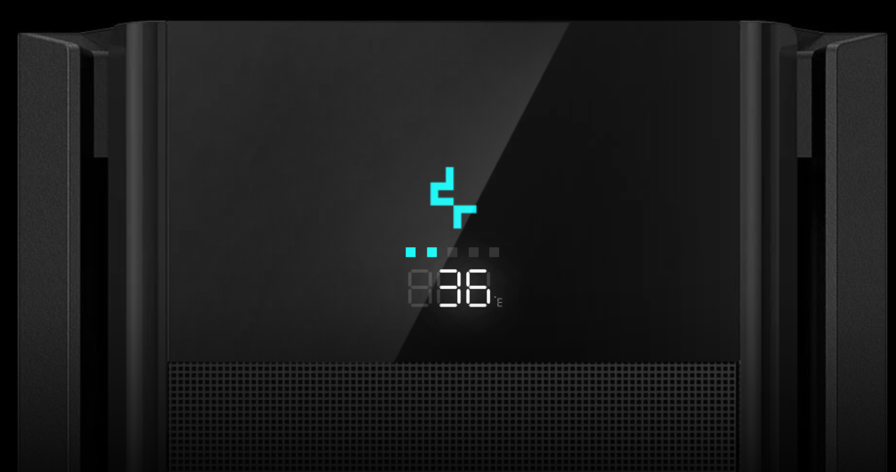

# DeepCool CH510 MESH Linux Driver

This project is an opensource implementation for the digital display controller of DeepCool's CH510 MESH DIGITAL cabinet. This implementation was carried out via reverse engineering by analyzing the USB communication packets between the controller and the display.

This driver supports displaying both the temperature in the Celsius or Fahrenheit scales, and also increases the display's "loading bar" according to the CPU usage load.



# Dependencies

* [golang](https://go.dev/doc/install)
* [libusb-1.0](https://github.com/libusb/libusb/wiki)
* [make](https://www.gnu.org/software/make/)

# Install

Install the required Go dependencies:

```sh
go get ./...
```

Then build the driver binary using make

```sh
make
```

Para instalar o binário e serviço utilize o target install no make como root

```sh
sudo make install
```

To install the binary and service use target install in make as root

```sh
systemctl enable --now opencool.service
```

# Settings

## CPU Temperature

There is no single location in Linux where it is possible to retrieve the CPU temperature, each manufacturer can specify their own, but they are all available in the same location to be accessed by any program in `/sys/class/hwmon`. In this directory, several devices that the kernel exposes for monitoring will be exposed and to find out which of these devices is the CPU, follow the steps:

Display the name of all devices:
```sh
cat /sys/class/hwmon/hwmon*/name
```

Find which device is your CPU in the kernel monitoring documentation (https://docs.kernel.org/hwmon/) and add the new device that needs to be monitored to the `config.yml` configuration file.

By default, the **k10temp** device is already configured, which is used for AMD processors from the 10th generation onwards (https://docs.kernel.org/hwmon/k10temp.html).

## Temperature Scale

The display allows you to display the temperature in Celsius or Fahrenheit. To configure, use `F` or `C` for Fahrenheit or Celsius respectively in the **temperatureScale** option in the `config.yml` file.

Default: **C**

## Update interval

It is possible to define the CPU temperature and loading check interval. To do this, use the **intervalTime** option in the `config.yml` configuration file. The value is measured in seconds.

Default: **2**